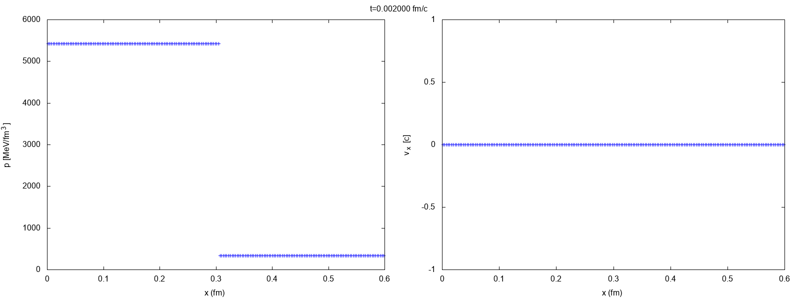
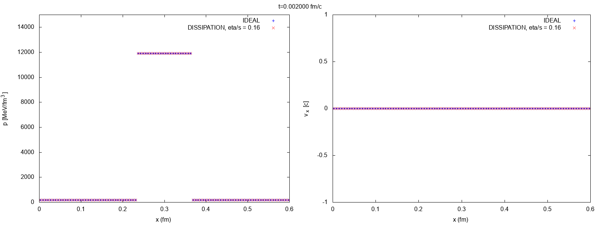

# Relativistic viscous hydrodynamics code for the simulation of QGP in heavy-ion collisions for 1 dimenson [](https://travis-ci.com/fleer/HIC_Solver_1D)

This program simulates the space-time evolution of the Quark-Gluon-Plasma in one spacial dimension, using numerical relativistic viscous hydrodynamics. 
The algorithm is based on [1], which is a modified version of the *Two-Shock Riemann Solver* presented in [2].
It utilizes the second-order Godunov method and is able to solve different kind of Riemann problems.

A Riemann problem is an initial-value  problem of the kind


where  and  characterize the left and right initial states that are separeted by a singularity.


## Build

### Building on Linux

Install the **GNU Scientific Library (GSL)**, eg.
     
```
 wget ftp://ftp.gnu.org/gnu/gsl/gsl-2.4.tar.gz;
 tar -xzvf gsl-2.4.tar.gz;
 cd gsl-2.4 && ./configure && make && sudo make install
```
Clone the repository and build the code via make

```
git clone https://github.com/fleer/HIC_Solver_1D.git
cd HIC_Solver_1D && make
```

### Building on OS X

Install [Homebrew](https://brew.sh/index_de.html):

```
/usr/bin/ruby -e "$(curl -fsSL https://raw.githubusercontent.com/Homebrew/install/master/install)"
```

Then install **gcc** (tested for gcc-5, gcc-6, gcc-7) with openmp support and the **GNU Scientific Library (GSL)**.

```
brew install gcc --without-multilib
brew install gsl
```

Clone the repository and build the code via make

```
git clone https://github.com/fleer/HIC_Solver_1D.git
cd HIC_Solver_1D && make CXX=g++-7
```


## Simulate
The program is able to solve simple Riemann Problems as the shocktube problem, but also problems with more complicated initial states.
The states , , ,  are characterized through their initial baryon density , velocity  and pressure . 

The code includes two different equations of state:

1. Approximated EoS of QCD, introduced in [3]
2. Eos of a free Gluon Gas [1][4]

Configuration files for the different types of problems are in `./Example_Configs`.<!--, together with [gnuplot](http://www.gnuplot.info/) scripts for plotting and generating *gif-animations*.-->

To start the simulation, execute the program and specify the configuration file, along with the folder where the results should be saved.

```
./hydro input.ini DATA
```

### Shocktube-Problem
The Shocktube-Problem was introduced by Gary A. Sod in 1978 [5]. Here, the initial state is chosen in a way that the pressure - and by thus the temprature - on the left side of the system is higher than on the right side. 



The configuration for the illustrated results, using the Eos of the *free gluon gas* can be found in `./Example_Configs/shock_tube_problem.ini`.

### Landau Model

The Landau model was developed in the early 1950's. It is the first model that proposed the idea of discribing the collision of hadronic matter with the help of relativistic hydrodynamics. (see e.g. [6, 7])

Landau primarily invented the model to describe the collision of two protons.
He assumed that during the collision, energy is released within a volume that corresponds to the Lorentz-contracted size of a proton.
This leads to a gradient in pressure which lets the system evolve.
As in the early stadium of the system the longitudinal pressure is much larger than the transversal pressure, Landau assumed that the early evolution of the system can be described by taking only one dimension under consideration (which is the direction fo the longitudinal pressure).  
<!-- At the point of time where the transversal pressure can no longer be ignored, a 3D hydrodynamics simulation has of course to be taken into consideration.-->

|| |
|:--:|:--:|
|Initial State of the system, described by the Landau model|Evolution of the system described by the Landau model|

The model is approximated by a disc which has the initial width of two nuclei, i.e.  with 

.

Here,  is the radius of the nucleus,  its mass and  the energy of mass of the nucleus-nucles collision.

The algorithm is able to approximately simulate the evolution of pressure and velocity for this early stages for the different equations of state and also for the case of a dissipative fluid.



The configuration for the illustrated results can be found in `./Example_Configs/landau_model.ini`.

#### Landau Model with small Pertubation
Additionally, a small pertubation can be implemented at .


---
[1] Akamatsu, Yukinao, et al. "A new scheme of causal viscous hydrodynamics for relativistic heavy-ion collisions: A Riemann solver for quark–gluon plasma." Journal of Computational Physics 256 (2014): 34-54.

[2] A. Mignone, T. Plewa and G. Bodo, arXiv.org (2005), astro-ph/0505200v1.

[3] Z. Fodor et al., Journal of High Energy Physics 2010 (2010) 77.

[4] E. Molnar, H. Niemi and D.H. Rischke, The European Physical Journal C 65 (2009) 615.

[5] G.A. Sod, Journal of computational physics 27 (1978) 1.

[6] W. Florkowski, Phenomenology of Ultra-Relativistic Heavy-Ion Collisions (World Scientific, 2010).

[7] W. Florkowski, arXiv.org (2014), 1410.7904.
