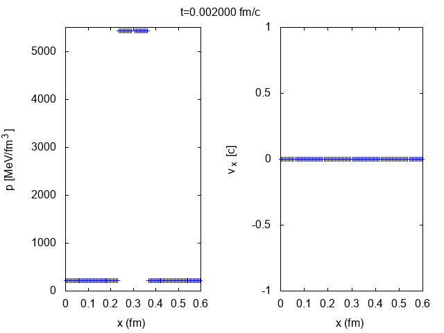

# Relativistic viscous hydrodynamics code for the simulation of QGP in heavy-ion collisions for 1 dimenson [](https://travis-ci.com/fleer/HIC_Solver_1D)

This algorithm simulates the space-time evolution of the Quark-Gluon-Plasma in one spacial dimension, using numerical relativistic viscous hydrodynamics. 
It is based on [1], which is a modified version of the *Two-Shock Riemann Solver* presented in [2].
It utilizes the second-order Godunov method and is able to solve different kind of Riemann problems.

A Riemann problem is an initial-value (\\(t=0\\)) problem of the kind
\\[
\mathbf{A}(x,0) = \left\lbrace \begin{array}{l r}
\mathbf{L} & \textrm{für} \; x <0 \\ & \\ \mathbf{R} & \textrm{für} \; x >0
\end{array}
\right. ,
\\]
where \\(\mathbf{L}\\) and \\(\mathbf{R}\\) characterize the left and right initial states that are separeted by a singularity.


## Build

### Building on Linux

Install the **GNU Scientific Library (GSL)**, eg.
     
```
 wget ftp://ftp.gnu.org/gnu/gsl/gsl-2.4.tar.gz;
 tar -xzvf gsl-2.4.tar.gz;
 cd gsl-2.4 && ./configure && make && sudo make install
```
Clone the repository and build the code via make

```
git clone https://github.com/fleer/HIC_Solver_1D.git
cd HIC_Solver_1D && make
```

### Building on OS X

Install [Homebrew](https://brew.sh/index_de.html) via:

```
/usr/bin/ruby -e "$(curl -fsSL https://raw.githubusercontent.com/Homebrew/install/master/install)"
```

Then install **gcc** (tested for gcc-5, gcc-6, gcc-7) with openmp support and the **GNU Scientific Library (GSL)**.

```
brew install gcc --without-multilib
brew install gsl
```

Clone the repository and build the code via make

```
git clone https://github.com/fleer/HIC_Solver_1D.git
cd HIC_Solver_1D && make CXX=g++-7
```


## Simulate

**At the current point, you have to create the ditectory 'DATA' where the results are written manually!**

The parameters for the simulation are stored in the `input.ini`. The program is able to solve simple Riemann Problems as the shocktube problem, but also more complicated problems.

```
#TEMPERATURE IN INITIAL STATE L1:
180
#INITIAL VELOCITY Vx IN INITIAL STATE L1 IN UNITS OF [c]:
0
#TEMPERATURE IN INITIAL STATE L2:
400
#INITIAL VELOCITY Vx IN INITIAL STATE L2 [c]:
0
#TEMPERATURE OF PERTUBATION:
400
#INITIAL VELOCITY Vx OF PERTUBATION L2 [c]:
0
#TEMPERATURE IN INITIAL STATE R1:
400
#INITIAL VELOCITY Vx IN INITIAL STATE R1 [c]:
0
#TEMPERATURE IN INITIAL STATE R2:
180
#INITIAL VELOCITY Vx IN INITIAL STATE R2 [c]:
0
#CHEMICAL POTENTIAL (24 MeV AT RHIC, 1 MeV AT LHC):
24
#END TIME [fm]
0.5
#TIME STEP [fm]
0.002
#NUMBER OF GRIDPOINTS 
100
#LENGTH OF SYSTEM
0.6
#ETA/S (DISSIPATION)
0.16
#NUMERICAL SCHEME (MUSCL, PPM)
MUSCL
#SLOPE LIMITER FOR MUSCL-SCHEME (MINMOD, MC, SUPERBEE, GODUNOV (=0)): 
MINMOD
#EQUATION OF STATE (GAS, QCD)
GAS
#DISSIPATION (Y, N, BULK)
BULK
#CFL NUMBER: 0.4
#CONSTRUCTION OF THE INITIAL STATE:
#L1 -> L2 -> PERTUBATION -> R1 -> R2
```


The initial states \\(\mathbf{L}_1, \mathbf{L}_2, \mathbf{R}_1, \mathbf{R}_2\\) are characterized through their initial baryon density \\(n_{\textrm{B}}\\), velocity \\(v\\) and momentum \\(p\\).

The code includes two different equations of state:

1. Approximated EoS of QCD, introduced in [3]
2. Eos of a free Gluon Gas [1][4]


### Shocktube Problem


### Landau Model
<!--

-->

---
[1] Akamatsu, Yukinao, et al. "A new scheme of causal viscous hydrodynamics for relativistic heavy-ion collisions: A Riemann solver for quark–gluon plasma." Journal of Computational Physics 256 (2014): 34-54.

[2] A. Mignone, T. Plewa and G. Bodo, arXiv.org (2005), astro- ph/0505200v1.

[3] Z. Fodor et al., Journal of High Energy Physics 2010 (2010) 77.

[4] E. Molnar, H. Niemi and D.H. Rischke, The European Physical Journal C 65 (2009) 615.